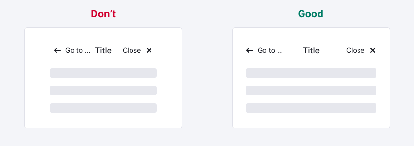

@## Description

**Fullscreen modal** is a modal window, which opens on top of the viewed page and completely closes its content. **It blocks all functions of the parent window and has a separate URL.**

**We use this component when:**

- it is necessary to fill in / edit / analyze a large amount of information with full focus on the task;
- it is necessary to show a large amount of additional data for the report and get a response from the user on what to do with these data;
- it is necessary to show a large amount of additional data for the report, but you don’t need to move it to a separate page. This is another flow of interaction with the report;
- the size of modal window that opened on the screen is less than 768px;
- all of the above happens together.

@## Appearance

Full-screen modal window consists of:

- a fixed header with required title and buttons for returning to the instrument and closing.
  content;
- fixed footer with **Submit** and other controls (optional).


@## Header

The header of the full-screen window has the following styles:

- general window title is h4 (`--fs-500`) or h3 (`--fs-400`), if necessary;
- additional information next to the title is 12 text of gray60 color.
- the size of the link to return to the tool is M (14px).
- window closing icon size is M.

> 💡 The header must be fixed, so that there always is an access to the opportunity to close such a window when scrolling.

```css
height: 72px;
padding: 0 32px;
border-bottom: 1px solid var(–gray80);
```


- Window subtitles must be less than h4/h3 (`--fs-500`/`--fs-400`) to maintain hierarchy in the content.
- If there is an area with colorgray baseplate, its color is `--gray-100` (`#eee`).
- Full-screen modal window can be single-zone and dual-zone.

| Single-zone modal window                           | Dual-zone modal window                             |
| -------------------------------------------------- | -------------------------------------------------- |
|  |  |

@## Very long window title

If the title of modal window is very long and it does not fit into the space allocated to it, do not forget to minimize it to `ellipsis`.

The window-closing button must have a left external margin of 24px.


@## Fixed footer


@## Buttons

- The size of the main window controls (submit, switching between windows) is L (32px).
- If a scroll appears in the content inside the window, the buttons may be fixed at the bottom of the window in case of scrolling.
- The height of the area under the button is 56px. The spacer should have the 1px solid `#CCCCCC` (`--gray-200`) border at the top.

> 💡 Note that the example below shows a default composition of all elements that can be changed. This means that the controls may not be in the center, they can be on the right, for example. Everything depends on the user’s flow and the number of controls.


@## Content paddings

`padding: 24px 40px 40px;`

| Single-zone modal window                                  | Dual-zone modal window                                      |
| --------------------------------------------------------- | ----------------------------------------------------------- |
|  |  |

@## Content adjusting

- If there are two columns / zones for content in the modal window, the content inside them is placed with `align: left`.
- If there is only one zone for content in the modal window, it is necessary to center the content with `align:center` horizontally. **We recommend you to consider an ordinary modal window in this case** 😏

| Single-zone modal window                                   | Dual-zone modal window                                     |
| ---------------------------------------------------------- | ---------------------------------------------------------- |
|  |  |

@## Interaction

You can close the full-screen modal window:

- By clicking on the `Close` button;
- By clicking on `CTA` or `Cancel` button;
- With the `Esc` button;
- With the back button in the browser (nothing changes on the parent page in this case).

> 💡 When the full screen modal window is closed, focus returns to the trigger.

@## What happens when the browser window size changes?

The header of the modal window should not have a fixed width; it is adjusted to the maximum size of the browser window.

If necessary, the content may have a fixed width (minimum or maximum).



@## Corner cases

### Loading

When loading and reloading the content of the window, the biggest [Spin](/components/spin) is shown.


### Error

If an error occurred during data loading, we show the error status with the corresponding text and the `Reload` button to reload the content of the window.

The error states are the same as in [Widget empty states](/components/widget-empty/).

### Limit


@page fullscreen-modal-a11y
@page fullscreen-modal-api
@page fullscreen-modal-code
@page fullscreen-modal-changelog
