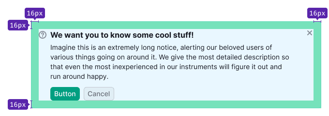
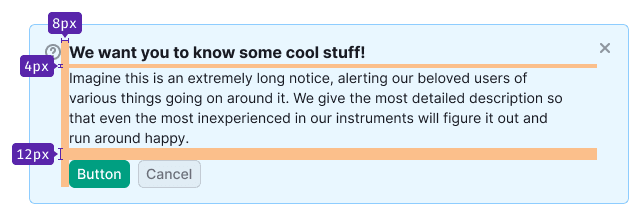
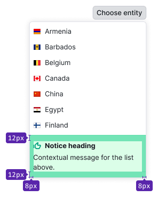
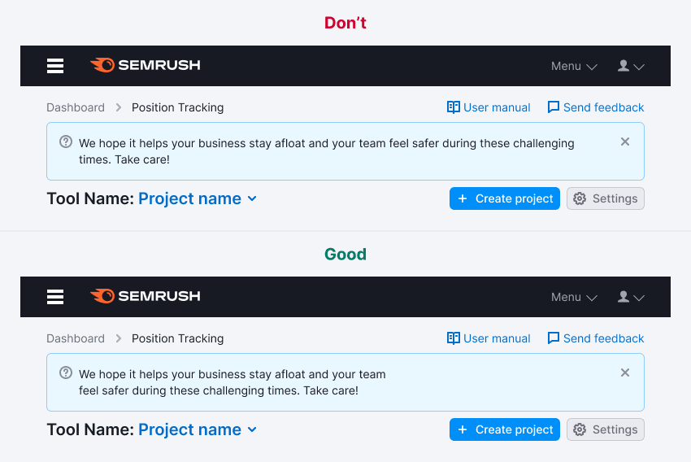
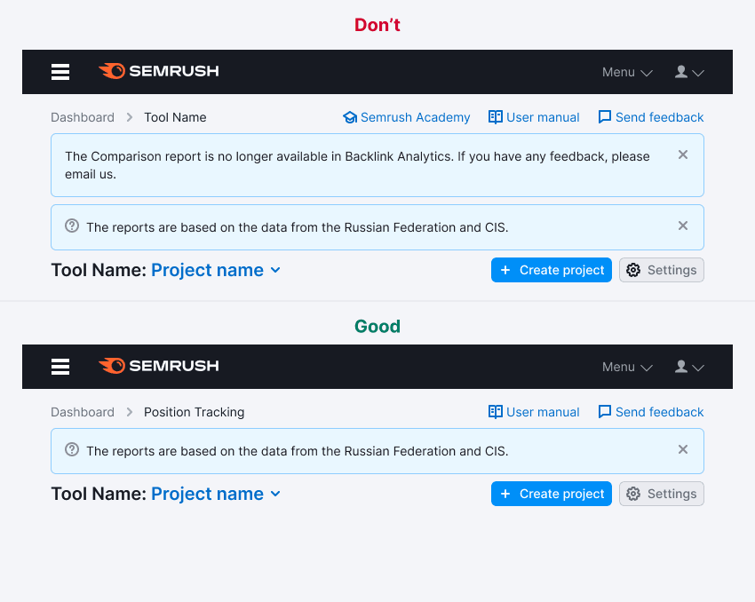
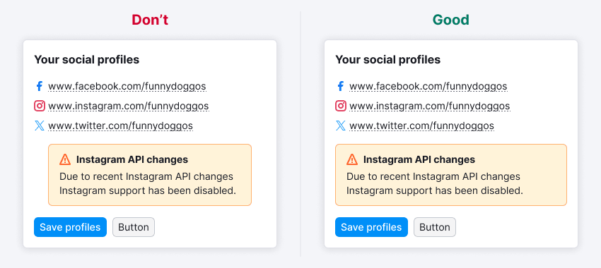
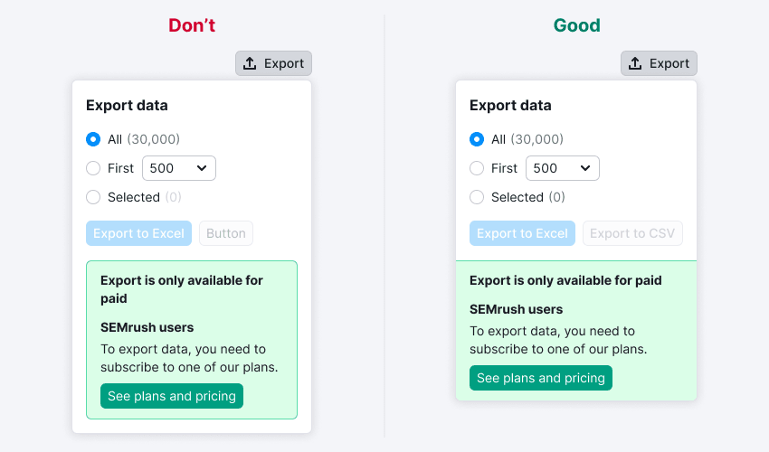

@import playground

> In the update of [version 4.0.0](/components/notice/notice-changelog/#v_4_0_0), instead of using `use=primary/secondary`, the component was split into two separate components - Notice and [NoticeGlobal](/components/notice-global/). This change was made to enhance their usability.

@## Description

**Notice** is a component for displaying messages related to events concerning the user's work in the interface.

It must fulfill four criteria to be considered a notice. Let's compare it to [NoticeBubble](/components/notice-bubble/) and [NoticeGlobal](/components/notice-global/):

@table-caption Comparison table of criteria for Notice, NoticeBubble and NoticeGlobal

| Criteria         | Notice | NoticeBubble | NoticeGlobal |
| ---------------- | ------ | ------------ | ------------ |
| Refers to the entire website      | ❌     | ✅ ❌        | ✅           |
| **Global**: Refers to pages, blocks, or large components rather than specific elements | ✅     | ✅ ❌        | ✅           |
| **Important**: Missing the notice may result in missed opportunities or loss of data | ✅     | ❌           | ✅           |
| **Temporary**: Appears and disappears under certain conditions, not a default block element         | ✅     | ✅           | ✅           |

**The notice message can be either:**

- contextual, appearing on product pages, widgets, and cards;
- global, relating to the entire product.

@## Component composition

The Notice component consists of:

1. `Notice.Content`
2. `Notice.Label`. It can be an [icon](/style/icon/), [badge](/components/badge/) or illustration that accompanies the message (optional);
3. `Notice.Actions` (optional).
4. `Notice.CloseIcon` (optional);

@## Notice content examples

@table-caption Notice content examples

|           | Appearance example |
| --------- | -------------------|
| Notice with minimum possible elements |  |
| Notice with maximum possible elements |   |

@## Sizes, paddings and margins

The notice can be used as a standalone component or embedded within other components. _For instance, it can be placed inside dropdowns and modal windows._

The internal paddings of the notice match those of the component it is nested within.

@## Maximum text width

Avoid stretching the text to the full width of the notice, particularly when the notice spans the entire screen width. Fully stretched text is inconvenient to read.

> We recommend to set the maximum width of the notice message to 650-800px.

@## Themes

@table-caption Notice themes

| Theme | Appearance example |
| ----- | ------------------ |
| **Info**: Used for neutral messages, information, and collecting feedback. For announcing new features or other products, consider using this notice with a large image (often referred to as [advertising notices](/components/notice/#advertising)). |  |
| **Success**: Used for triggers related to purchasing or taking a trial, as well as displaying successful completion of forms, for example. |  |
| **Warning**: Suitable for important but non-critical errors or warnings, such as service reports, unavailable functionality, or temporary failures. | |
| **Danger**: Intended for serious errors, problems, or actions that prevent users from continuing their work or result in data loss. |  |

@## Placement in the interface

### On the page

If the notice is applicable to the entire product, position it in the product header (below the breadcrumbs) and let it inherit the width of the content section. For more information about paddings and margins, refer to the [ProductHead](/components/product-head/).

> Avoid placing multiple notices on the page simultaneously.

If the message pertains solely to the content of a specific tab within the product, position the notice beneath the [TabLine](/components/tab-line/).

### Inside the widget

If the notice is associated with a widget, position it inside the widget. The exact placement will depend on the context. Generally, in such cases, the notice should inherit the width of the content section of the widget.

### Inside the component

If the notice only relates to the component, position it at the top or bottom of the component and let it inherit the width of the component.

@## Interaction

### Opening

The notice should appear instantaneously without any delays or visual effects. It should be displayed immediately upon the loading of the page or component.

### Lifespan

Since the notice serves as a temporary notification, it should have a predefined "lifespan." The lifespan can be determined by the following rules:

- Number of days (for example, for the duration of an experiment)
- Number of user sessions
- Specific events (for example, completion of tasks, bug fixes, transitioning features out of beta)
- User actions as triggers (for example, installing something, viewing specific content, resolving an error)

### Hiding

- Clicking on the `Close` icon.
- Clicking on a link that triggers a re-opening condition (for example, "Ask me later," "Never show again," etc.).
- If there is no `Close` icon or hide link, the user cannot manually hide the notice. It will be hidden automatically based on conditions set by the service (such as a specific duration, a certain number of sessions, or triggering a specific action).

### Animation

When the close icon or closing link is clicked, the notice should smoothly fade out with a duration of `250ms`. The page content should transition to fill the space vacated by the notice within `250ms`.

@## Custom notice

Custom notices have their own rules and distinct styles compared to the default themes.

### Feedback notice

The feedback notice deviates from the regular notice as it is attached to the header and spans the entire width of the content section of the report. It has no margins at the top, right, or left. You can refer to the [FeedbackYesNo](/patterns/feedback-yes-no) guide for an example.

### Advertising

The advertising notice is designed to capture the user's attention more effectively than a notice with default theme. It should be used when announcing features, updated versions, relocations, limited-time promotional actions, and similar purposes. If your product doesn't require such emphasis, use a notice with the `info` theme.

The advertising notice differs from the default notice through the inclusion of advertising illustrations and the option to incorporate controls like input fields and select dropdowns to engage users quickly.

> Please refrain from using an advertising notice for an "empty" state on a page or inside a component.

@## Usage in UX/UI

### General rules

- Notices can be used to notify users about various events, such as product and report announcements, collecting feedback, providing quick help for additional features, system status (errors, failures, completion of tasks, new features), and more.
- In certain cases, notices with the same text may have different colors to convey different meanings.
- Typically, notices are replaced by others based on priority: red > yellow > green > blue > gray.
- Be concise and avoid overshadowing other widgets or report functionalities. Strive to convey the message to users within two lines for notices, and within four lines for notices within blocks or other components.

### Incorrect use

A notice should not be mistaken for other components:

- **[NoticeBubble](/components/notice-bubble)**: NoticeBubble is a local component used to respond to user actions, while a notice is a global component that is generally not associated with user actions.
- **[Tooltip](/components/tooltip)**: Tooltips are used to provide hints or descriptions of functionality and are permanently displayed upon hover. On the other hand, notices are temporary components that typically appear immediately after user actions.
- **[Notes, hints](/style/typography/#hints_hint_links)**: Notes and hints provide additional information about functionality and are permanent in nature. In contrast, notices are temporary and don’t explain the functionality itself. At most, they may provide guidance on resolving reported problems or performing required actions.

### Examples of incorrect usage

Avoid using notice to show permanent informational message within a form.

An error related to a temporary failure. In this case, a notice with `warning` theme should be used.

A notice appearing on top of the interface to indicate the completion of a hidden process. It is advised to avoid this and use [NoticeBubble](/components/notice-bubble) instead in such cases.

@page notice-a11y
@page notice-api
@page notice-code
@page notice-changelog
