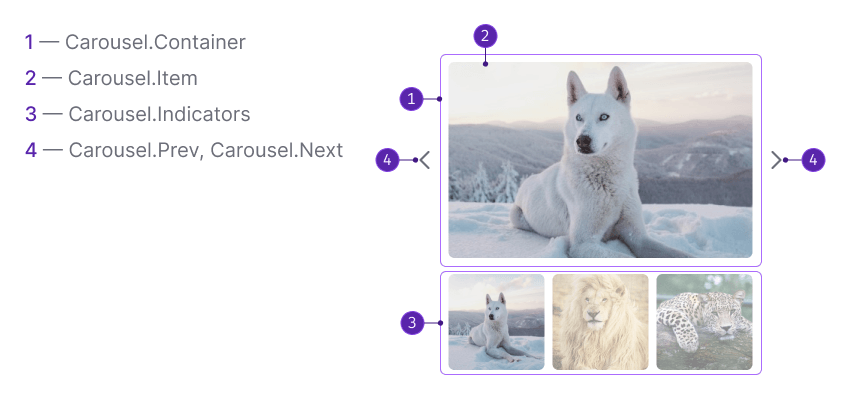
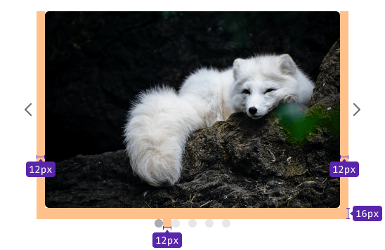

## Description

**Carousel** is a component for displaying a group of content in a limited area of the interface. Most often used for gallery of images or cards.

**Use carousel when:**

- There is a group of content on the same level (for example, images or modals with data opened from table rows). In this case, the carousel saves the user's clicks.
- There is insufficient space in the interface, so carousel can save it.

::: tip
Carousels are great for cases when multiple content items need to occupy the same space on a page. Note, that carousels on the homepages are typically ignored by users, don’t engage and frustrate users. Learn more in [this funny explanation website about usage of a carousel component](http://shouldiuseacarousel.com/).
:::

Use the carousel as an additional highlight of important website features and information, never as the only path to an important content.

## Component composition

Component consists of the following:

- Container for items: `Carousel.Container`
- Slide with content: `Carousel.Item`. Slide contains image, video or another type of information
- Slides number indicator (optional): `Carousel.Indicators`
- Navigation buttons: `Carousel.Prev`, `Carousel.Next`

## Appearance

Component has default styles, but you can change them depending on your task.

### Default styles

Table: Carousel default styles

|                         | Default styles                                                        |
| ----------------------- | --------------------------------------------------------------------- |
| Navigation buttons      | Use L size for Chevron icons and `--icon-primary-neutral` token for color. |
| Slides number indicator | Indicator has 12px * 12px size and `--bg-secondary-neutral` token for color.  |
| Content slide           | `border-radius: var(--rounded-medium)`                               |

Click-zone of the navigation buttons (`Carousel.Prev`, `Carousel.Next`) is stretched to the height of the content.

### Margins

### Example with dark background

This example has the same styles as the example on the light background, except color for buttons that change slides – it should change to `--icon-primary-invert`.

## States

### Navigation buttons

Navigation buttons are always center aligned.

Table: Navigation buttons states

| State    | Appearance example                      | Styles                                               |
| -------- | --------------------------------------- | ---------------------------------------------------- |
| Default  |    | `color: var(--icon-primary-neutral)`              |
| Hover    |   | `color: var(--icon-primary-neutral-hover-active)` |
| Disabled |  | `opacity: var(--disabled-opacity)`                  |

### Slides number indicators

Table: Slides number indicators states

| State               | Styles                                                                                    |
| ------------------- | ----------------------------------------------------------------------------------------- |
| Default + Disabled  | `color: var(--icon-secondary-neutral)` + `opacity: var(--disabled-opacity)`    |
| Hover               | `color: var(--icon-secondary-neutral)` + `calc(2 * var(--intergalactic-disabled-opacity, 0.3))`          |
| Active              | `color: var(--icon-secondary-neutral)`                                                  |

## Animation

Default animation properties:

- Animation duration – `300`.
- Animation easing function – `ease-in-out`.

## Usage in UX/UI

When using a carousel, keep in mind that some users may only see the first frame or nothing at all. Therefore, it's important to intentionally place essential content on each frame. Consider using a static carousel or a single image instead of a rotating one.

Table: Carousel usage advices

|       | Advice                                                                                                 | Description                                                                                                                                                                                                                                                                           |
| ----- | ------------------------------------------------------------------------------------------------------ | ------------------------------------------------------------------------------------------------------------------------------------------------------------------------------------------------------------------------------------------------------------------------------------- |
| **1** | Include 5 or fewer frames within the carousel, as it’s unlikely users will engage with more than that. | Scrolling through multiple slides on a mobile device can be tedious, and it's hard for users to recognize topics they've already viewed once the set is over five or so. Limiting the quantity also helps with content discovery and subsequent re-search of content in the carousel. |
| **2** | Indicate the number of slides.                                                                         | Specify how many slides are present and where the user is in sequence to help people feel in control.                                                                                                                                                                                 |
| **3** | Make links and buttons large enough to decipher and click.                                             | Tiny buttons placed close together or on top of a busy background are not easy to spot or click.                                                                                                                                                                                      |

## Auto-play

::: tip
If carousel images cycle automatically, provide a pause button to let users stop the movement.
:::

**Don’t auto-play slides if:**

- You are not sure you can get the timing right, so that most people read and understand the content within the time you specified. Sometimes carousels move too quickly, and users can’t read the information, which is frustrating for them. Sometimes carousels move too slowly, so when they do animate, it can be surprising to the user.
- Your content looks like an advertisement. Users are more likely to ignore an animated item that looks like an ad ([if they are not in a shopping mindset](https://www.nngroup.com/articles/designing-effective-carousels/))).

### Auto-play tips

- Don’t add auto-play on mobile devices, because: (1) it slows down the page, and (2) because pages are short, users often scroll quickly, so by the time the carousel changes, the user is likely looking below the fold and won’t see the change anyway.
- Test for the right timing, or at least estimate how long it might take the average user to read the text and process the images. Nielsen Norman Group recommends 1 second per 3 words for auto-rotating slides. Don’t stop at the last frame. Continue cycling through the frames (and displaying which frame is selected).
- Auto-play should pause on hover.
- Auto-play should permanently stop after any active user interaction.

### Static (non-auto-play) carousel tips

Make sure users interested in the carousel understand that there is more to it than just the currently displayed image/content. Offer clear visual elements that represent the notion of more content, such as:

- navigation controls and icons (as noted above);
- cutting off, or “bleeding” an image and displaying part of the next image.

