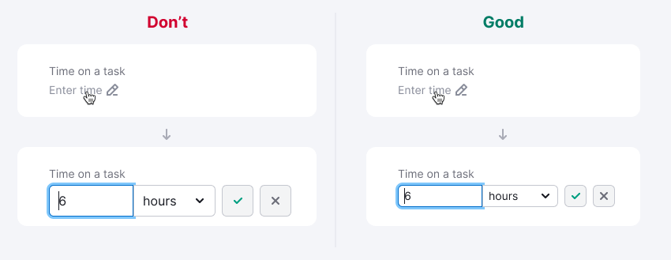

## Description

**InlineEdit** is a wrapper component that enables a smooth transition between viewing and editing data.

**Use this component when:**

- You need to effortlessly switch between read-only and text editing modes without requiring a page reload.
- The interface is spatially constrained, necessitating efficient use of space.
- Transmitting data to the system isn't the primary focus of the interface (for example, providing supplementary information and notes within cards).

## Appearance

It's important to note that the example below serves merely as an illustration and isn't the default configuration. Any control component, whether it's a [Button](/components/button/), an [Icon](/style/icon/), or text with an icon, can be utilized as a trigger.

The placeholder's color aligns with that of a typical input element, utilizing the variable `--text-placeholder`. The text and icon share an active zone.

## Interaction

- The user clicks the trigger, which opens an input field.
- The input field gains immediate `focus`.
- The user inputs data and can choose to save it. Alternatively, the user can revert to view mode by using the cancel button or the `Esc` key.
- When the input field loses `focus` (for instance, if the user switches to another screen), the `onBlur` event preserves the entered value.

Below is an example demonstrating how this component functions with one of the possible triggers.

Table: InlineEdit states

| State                   | Appearance example     | Styles  |
| ----------------------- | ---------------------- | ------- |
| Normal                  |         | The placeholder's color matches that of a default input `--text-placeholder`.    |
| Hover                   |          | The cursor changes to a `pointer`. The icon's color shifts to `--icon-secondary-neutral-hover-active`.    |
| Focus                   |         | Display the input type required for data entry ([normal](/components/input/), [textarea](/components/textarea/), [select](/components/select), [color-picker](/components/color-picker), [time-picker](/components/time-picker), for example). |
| Entered data            |        | Text color changes to `--text-primary`.      |
| Entered data with hover |  | The cursor changes to a `pointer`. The interactive trailing add-on's color shifts to `--icon-secondary-neutral-hover-active`.|

## Animation

The transition between the wrapped trigger and the input field can be accomplished with an `ease-in-out` effect lasting `50ms`.

## UX/UI use

In view mode, ensure that the text size matches the size of the edit input you've selected.

For instance, if the heading you wish to edit employs a font size of 24px, maintain the same font size of 24px when transitioning to edit mode.

