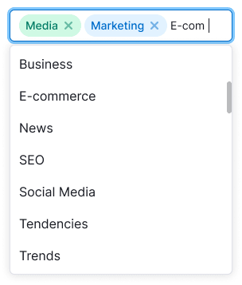
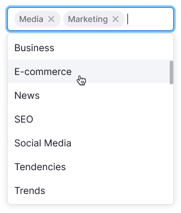
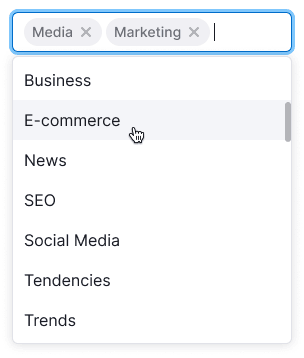
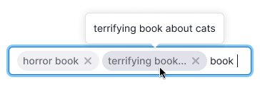

@import playground

## Description

**InputTags** is an input field that wraps entered information into tags. It is commonly used alongside the [Combobox](/components/auto-suggest/).

This input field is useful for entering a large amount of similar information in a single field, such as keywords or employee emails.

## Appearance

When there are too many tags to fit within the input, the input field's height increases by one line of text.

Table: InputTags sizes

| Size     | Appearance      |                 | Margins        |
| -------- | --------------- | --------------- | -------------- |
| M input is used with the M tag |  |  |  |
| L input is used with the L tag |  |  |  |

## Tag colors

::: tip
To learn more about tags, refer to the [Tag](/components/tag).
:::

In most cases, we recommend using tags with the `primary` type and the `muted` theme for entering homogeneous information in these inputs. It isn’t recommended to use the [Secondary tag](/components/tag/) inside the input as it adds unnecessary visual noise with its border.

When validating the input, inappropriate data can be highlighted in red. **Remember to provide clear error messages in tooltips.**

In some cases, you can use color tags to represent different categories, if applicable.

## Interaction

In an input field with tags, you can enter data either by selecting preset options from the combobox or by entering your own data (which will be wrapped in tags if they have punctuation separators). You can also combine both options.

Table: Interaction with InputTags

| Data from the combobox    | User-entered data   | Data from the combobox and user-entered data    |
| ------------------------- | ------------------- | ------------------------ |
|  |  |  |

When you focus on the input field, if there are preset options available (such as a database of minion addresses or previously entered keywords), a [Combobox](/components/auto-suggest/) will open. Clicking on a line in the combobox will insert the corresponding data into the input field and wrap it in a tag.

If the input field doesn't have preset options and allows users to enter any data, the entered data will be wrapped in a tag using punctuation separators, as described below.

## Wrapping text in tag

The text entered by the user is automatically converted into a tag inside InputTags in the following cases:

- When the input field loses focus (for example, by tabbing out).
- When the user presses the `Enter` key.
- When entering a punctuation separator ("," , ";" , "|").
- When there is a double space.
- When the user presses the Tab key to insert data.

::: tip
Leading and trailing spaces are trimmed when creating tags.
:::

## Text insertion

After inserting data, the text is split into tags based on punctuation separators like commas, semicolons, vertical bars ("|"), or pressing the `Tab` key.

## Deleting and editing a tag

If the text cursor is positioned in front of a tag, pressing the `Delete` key will convert the tag back into plain text, allowing for editing and deletion.

## Handling long text within a tag

::: tip
Note that this behavior isn’t recommended for full accessibility. Web page content should be responsive and adaptable to small viewport widths, text enlargement, and changes in text spacing.
:::

You can set a maximum width for tags, although it isn’t necessary in all cases. If the tag text exceeds the specified width, truncate it with an ellipsis. Hovering over the tag will display a tooltip with the full text of the tag.

