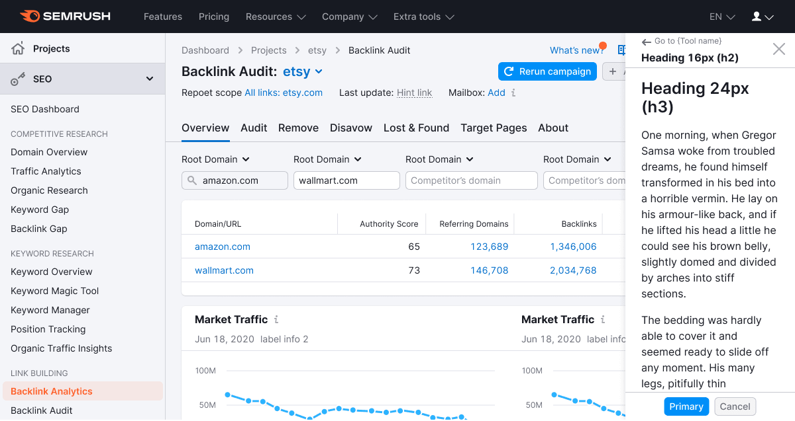
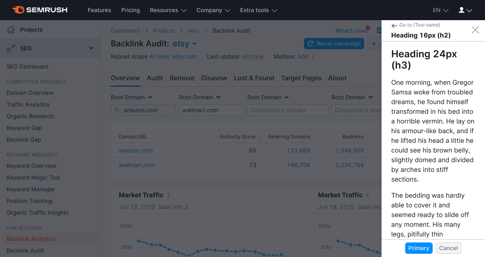
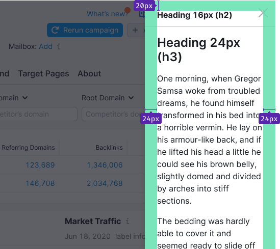
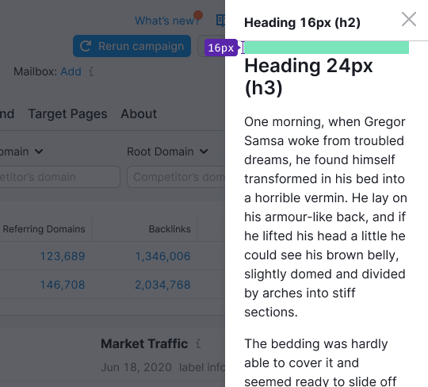
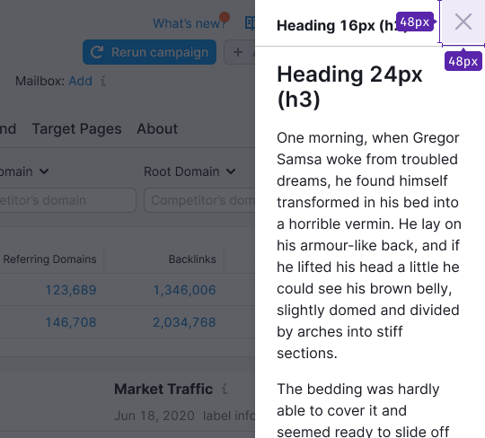
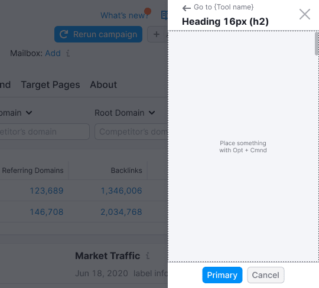
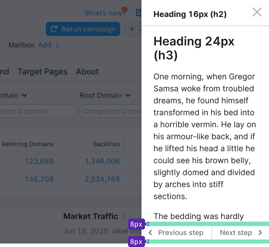
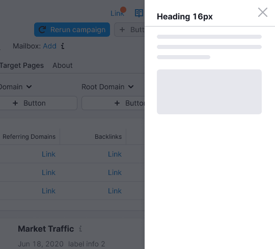
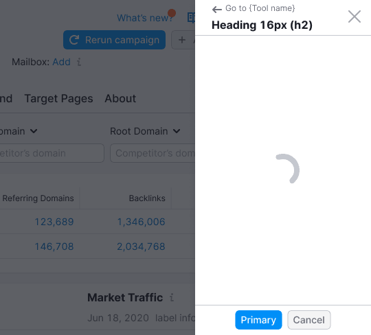
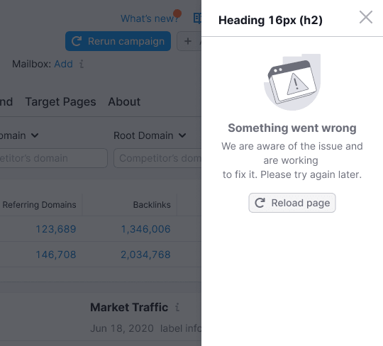

::: tip
In the [2.0.0 version](/components/side-panel/side-panel-changelog/), the component was divided into three parts: `Header`, `Body`, and `Footer`. This was done to make it easier to restyle the component. Additionally, an optional `Back` button was added.
:::

## Description

**SidePanel** is a component used for displaying sliding panels with content. It can also be referred to as a panel or drawer.

**Use SidePanel when you need:**

- To show sub-tasks, additional support information, and links that may be useful to the user while working with a report, a specific widget, or the entire product.
- To keep the user in the context of the page (even if the SidePanel has an overlay).

::: tip
Use [Modal windows](/components/modal/) to show important information or request a response from the user.
:::

**For example, you can use SidePanel as:**

- A notification center for the whole website.
- A Help Center or News panel in products.
- "Panels" on mobile devices.

## Component composition


Component consists of the following:

1. `SidePanel.Header`
2. `SidePanel.Back`
3. `SidePanel.Title`
4. `SidePanel.Close`
5. `SidePanel.Body`
6. `SidePanel.Footer`
7. `SidePanel.Overlay`

## Trigger

The trigger for opening the SidePanel can be the following:

- A `News` icon in the main header of the website.
- Additional links in [ProductHead](/components/product-head/).
- Controls that hide additional information.
- Charts that can be clicked to show additional information.
- On small screens, other controls can serve as triggers to open SidePanel.

## Overlay

Table: SidePanel with and without overlay

|                 | Appearance example                     | Styles                                                                                                           | When to use                                                                             |
| --------------- | -------------------------------------- | ---------------------------------------------------------------------------------------------------------------- | --------------------------------------------------------------------------------------- |
| Without overlay |  | In this case the panel has only the shadow: `box-shadow: 0px 1px 12px var(--box-shadow-popper)`. There is no overlay. | Use this version if you need to show additional information for a report/product/block. |
| With overlay    |    | In this case panel has an overlay with styles: `background-color: var(--overlay-primary)`.   | If you need to focus the user on information inside SidePanel, enable overlay.          |

## Sizes and indents

### Width

SidePanel has a fixed width that doesn't change when the browser window is resized. The default width of the panel is 256px. You can change it if necessary.

### Container

**The component has a default padding.** It can be changed if necessary.

_It can be changed, for example, when using SidePanel on a small screen where you want to reduce paddings._



### SidePanel.Body margins

The padding between the title and content:



## Default styles

### Header

For the panel's title, use 16px text (`--fs-300`, `--lh-300` tokens) with `font-weight: var(--bold)`.

::: tip
Pin the header when scrolling large content inside the SidePanel.
:::

Table: SidePanel.Header styles

| Appearance example     | Styles         |
| ---------------------- | -------------- |
|  | `height: 52px`, `padding-bottom: var(--spacing-1x)`, `align-items: center`, `border-bottom: 1px solid var(–-border-primary)` |
|    | The `Close` icon has an L size and uses `--icon-secondary-neutral` token for color. The click zone of the icon is `48px * 48px`.   |

### Content

General recommendations for SidePanel content styles:

- Choose the text size for the panel to maintain a hierarchy of headers in the content within SidePanel. If necessary, you can experiment and use your text size hierarchy within our [typographic scale](/style/typography/).


- Always pin the header and the footer when scrolling the content of the SidePanel.



### Footer

You can place common controls for SidePanel content in the footer.

- Typically, any controls, CTA, or other elements like [ProgressBar](/components/progress-bar) can be placed there.
- The recommended size of controls in the panel on the desktop is M. Depending on the context, use M or L controls in the panel on small screens.

Footer styles:

```css
height: 44px;
padding: var(--spacing-2x) 0;
align-items: center;
border-top: 1px solid var(–-border-primary);
```




## Interaction

### Placement in the interface

- You can customize whether the SidePanel should open in the product area or over the entire website (as modal windows do). If the SidePanel refers to a specific product, it should be rendered in the product under the main header.
- The focus remains inside the SidePanel and doesn't move to the page content. You can navigate through the controls inside the SidePanel using  `Tab`.

### Page scroll

Page scroll is disabled by default. We recommend you to enable it only when SidePanel has some tips and additional information for the page, and no overlay is enabled.

::: tip
Always disable page scroll for SidePanel with an overlay.
:::

### SidePanel opening and closing

You can close the panel with:

- CTA control;
- `Close` icon;
- Clicking outside the area of the panel (at overlay), optional;
- `Esc` key.

SidePanel can be opened either by the user clicking on the corresponding trigger or by the system in special cases to draw attention to the information in the panel.

### Animation of appearance and hiding

SidePanel opens and closes with the animation: `transition: all 350ms ease-in-out`.

### What happens when the browser window size changes

- SidePanel has a fixed width that doesn't change when the browser window is resized. The default width of the panel is 256px. You can change it if necessary.
- On a 320px screen, SidePanel should not occupy more than 80% of the screen width so that the user can click outside of it and close it.


## Edge cases

SidePanel should have a header in all cases.

### Initial load

At the initial load of the SidePanel content, show the content structure with [Skeleton](/components/skeleton/).



### Reloading

When loading and reloading SidePanel content, show [Spin](/components/spin/) with XL size in the center.



### Error

If an error occurs during data loading, show the corresponding message and the "Try again" button to reload the SidePanel content.



