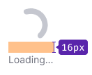

@import playground

## Description

**Spin** is a component used to display the loading state of a page, section, or widget when the system does not have an exact data loading time.

To display Spin around any component, use [SpinContainer](/components/spin-container/).

> This component demonstrates the loading and response to user actions in the interface. For general recommendations regarding such components, refer to the [Loading patterns](/patterns/loading-states/).

## Sizes and margins

The Spin component comes in six different sizes. The text size should be at least 14px.

@table-caption Spin sizes and margins

| Size    | Text below                        | Text on the right                   |
| ------- | --------------------------------- | ----------------------------------- |
| **XS**  |   |   |
| **S**   |    |    |
| **M**   |    |    |
| **L**   |    |    |
| **XL**  |   |   |
| **XXL** |  |  |

## Styles

> For recommendations on Spin positioning and indents in blocks and on the page, refer to [SpinContainer](/components/spin-container/).

You can place text next to the spinner to inform the user that data is being loaded. The text should use the `--text-secondary` token for color, as it is considered a secondary message according to the overall visual hierarchy of the page.

**Text can be placed on the right or below the spinner.** In small components, blocks, and widgets, place the text to the right of the spinner. For large components, blocks of components, or inside large blocks and widgets, we recommend placing the text below the spinner and using one of the four largest Spin sizes.

## Themes

Spin has two themes: `dark` and `invert` – for use on light and dark/colored backgrounds, respectively. Additionally, you can customize the Spin color as needed.

@table-caption Spin themes

| Theme    | Appearance example        | Description                                          |
| -------- | ------------------------- | ---------------------------------------------------- |
| `dark`   |     | Use this theme of Spin on a light background.        |
| `invert` |   | Use this theme of Spin on a dark/colored background. |

## Animation

For Spin appearance and disappearance, use an animation with a 300ms delay and `ease-out` easing.

## Usage in UX/UI

Remember that the page loading indicator should help the user estimate the interface's response time (specifically how long they should wait for a certain result). Therefore, in cases where the system cannot determine the exact data loading time, we recommend adding an explanatory message next to the spinner, for example:  **Loading...**.

@page spin-a11y
@page spin-api
@page spin-changelog
