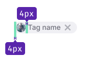
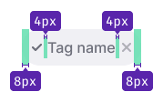
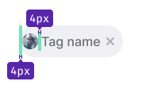
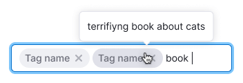
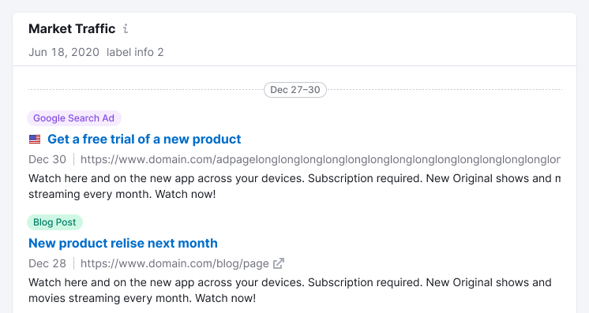
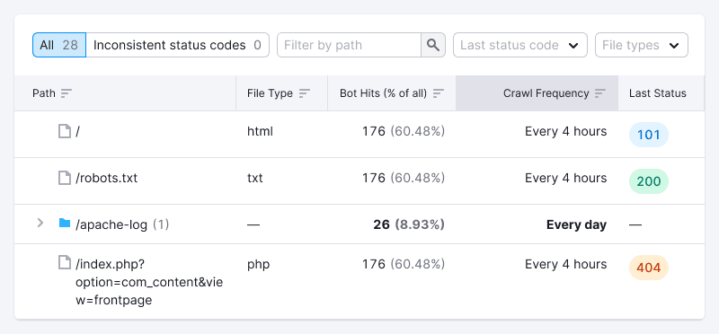

::: react-view

:::

## Description

**Tag** is a component used to thematically group information in the interface, commonly found in tables, filters, cards, and other components.

Tags are typically set either by the system or by the user.

## Component composition

Component consists of the following:

- `Tag.Text`
- `Tag.Addon`: icon or any other small element before the text
- `Tag.Close`
- `Tag.Circle`: a circle image

## Sizes and paddings

Table: Tag sizes and paddings

Size (height in px) | Paddings                                       |
| ----------------- | ---------------------------------------------- |
| M (20px)          |     |
| L (28px)          |     |
| XL (40px)         |   |

## Themes

The component offers several themes for tags.

| Tag theme     | Appearance example            | Description     |
| ------------- | ----------------------------- | --------------- |
| `primary`                         |                    | The `primary` theme of tag suitable for use on a light background. Any color from [color palette](/style/design-tokens/#base_tokens_palette) can be set as a tag color, with the default color being `--gray-500` (background gets color with 100 shade, for example, `--gray-100`). |
| `primary` with `color:"white"`    |      | An inversion of the `primary` tag meant for dark or colored backgrounds.|
| `secondary`                       |                | The `secondary` tag theme, useful on a light background when contrast between the primary and secondary tags is required.|
| `secondary` with `color:"white"`  |  | An inversion of the `secondary` tag suitable for dark or colored backgrounds.|
| `additional`                      |              | Ideal for special tags that are added to other tags. |
| `additional` with `color:"white"` |       | An inversion of the `additional` theme used for special tags that are added to other tags. |

## Interaction

Table: Tag states

| Tag theme                        | States                                                                |
| -------------------------------- | --------------------------------------------------------------------- |
| `primary`                        |             |
| `primary` with `color:"white"`   |              |
| `secondary`                      |                |
| `secondary` with `color:"white"` |  |

## Adding tag

Users can create tags using tags with the `additional` theme.

| State  | Appearance example                  | Styles    |
| ------ | ----------------------------------- | --------- |
| Normal |  | `color: var(--text-secondary)`, `background-color: var(--tag-secondary-normal)`, `border: 1px dotted var(--border-primary)` |
| Hover  |   | `background-color: var(--tag-secondary-hover-active)`                                                                         |
| Active |  | `background-color: var(--tag-secondary-hover-active)`                                                                         |

This tag opens [InlineInput](/components/inline-input/), and you can add a [mask label](/components/input-mask/) to guide the user on what to type into the input.

Upon clicking the `Check` icon or pressing `Enter`, the input value is saved and transformed into a tag.

If space for tag placement is limited, the text should be truncated with an `ellipsis`. Hovering over a tag with an `ellipsis` displays a tooltip with the full tag label.

## Editing tag

For editable tags, use the [InlineInput](/components/inline-input/) component, similar to adding a tag. Refer to the [live example](/components/tag/tag-code/#editing_tag).

## Long text

You can set a maximum width for the tag. If the text of a tag exceeds this limit, it will be collapsed with an `ellipsis`, and hovering over the tag will show a tooltip with the full tag label.

<!-- @## Minimizing number of tags

In case you have a huge number of tags and don’t need to show them all at once, minimize them to a tag with three dots. When you click on it, all hidden tags will be opened.

::: tip
Unfortunately, this solution can be found in several places so far.
:::

 -->

## Margins between tags

Table: Margins between tags

Size (height in px) | Margins                 |
| --------- | ------------------------------- |
| M (20px)  |    |
| L (28px)  |    |
| XL (40px) |   |

<!-- @## Tag and other components

Recommendations on positioning of tags in relation to other components:

- In most cases, place tag to the right of the component.
- In the card, place tag at the bottom. -->

## Usage in UX/UI

Use tags for visual marking of objects, fast recognition and navigation.

### Example of usage in card

### Example of usage in table

