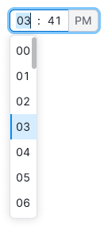
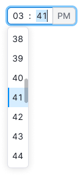

@import playground

## Description

**Time picker** is a component that consists of comboboxes designed for entering or selecting a time value.

## Component composition

Component consists of the following:

- `TimePicker.Hours`
- `TimePicker.Minutes`
- `TimePicker.Format`
- `TimePicker.Separator`

## Appearance

The component includes [comboboxes](/components/auto-suggest/#Combobox) inside the input field.

If the user needs to choose the time in a 12-hour format, an additional button for switching between AM/PM is provided, eliminating the need for an extra click on the dropdown.

@table-caption TimePicker 24-hour and 12-hour formats

| Time format    | Appearance example              |
| -------------- | ------------------------------- |
| 24-hour format |  |
| 12-hour format |          |

## Sizes and paddings

@table-caption TimePicker sizes and paddings

| Input size (height in px) | Appearance example                 | Paddings                           |
| ------------------------- | ---------------------------------- | ---------------------------------- |
| M (28px)                  |   |  |
| L (40px)                  |   |  |

## Interaction

The first combobox is used for selecting hours, while the second one is for selecting minutes.

Upon focusing on a combobox, a list with all the possible options is opened. When focusing on this group of controls, the input field is highlighted.

> The dropdown with the list is shifted to the left by 9px to accurately align the list items with the combobox figures.

The button allows the user to switch between AM and PM values with a click.

When the user navigates to a button with the `Tab` key, the button receives `focus` state.

- Users can select the time using the comboboxes with the mouse or enter it manually.
- After completing the first field, the cursor automatically moves to the second field.
- The inputs only accept numeric values with a maximum of two digits in each combobox.

### Comboboxes content

The content of the comboboxes can be exact, up to a minute, or with preset steps.

- In the first case, the combobox step equals one minute, allowing the user to set precise times, such as 13:13.
- In the second case, the combobox step can be adjusted depending on the required time pre-settings. For example, popular steps may include 00, 15, 30, 45, etc., for minutes.

> Comboboxes content may be both exact, up to a minute, and with the preset step.

## Validation

### When TimePicker needs validation

Validation in this component is required in several cases:

- When there is a selection of multiple time slots, and they cannot be set to equal values.
- When users cannot select times in the past or future. In this case, the time selection also depends on the date selection, and the validation applies to the entire group of controls.

### How the validation is performed

- All the fields related to the selection of the date and time receive the status `invalid`.
- A tooltip with the description of the error is shown in the first field without placing the focus on the field.
- Validation occurs upon submitting the entire form.

@page time-picker-a11y
@page time-picker-api
@page time-picker-code
@page time-picker-changelog
