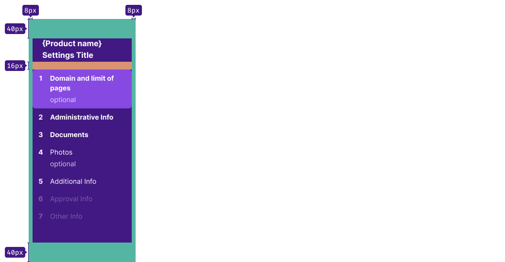
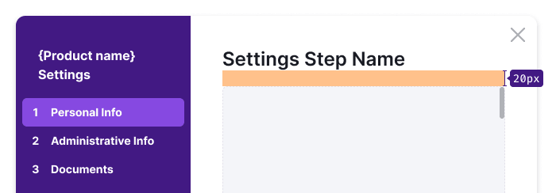
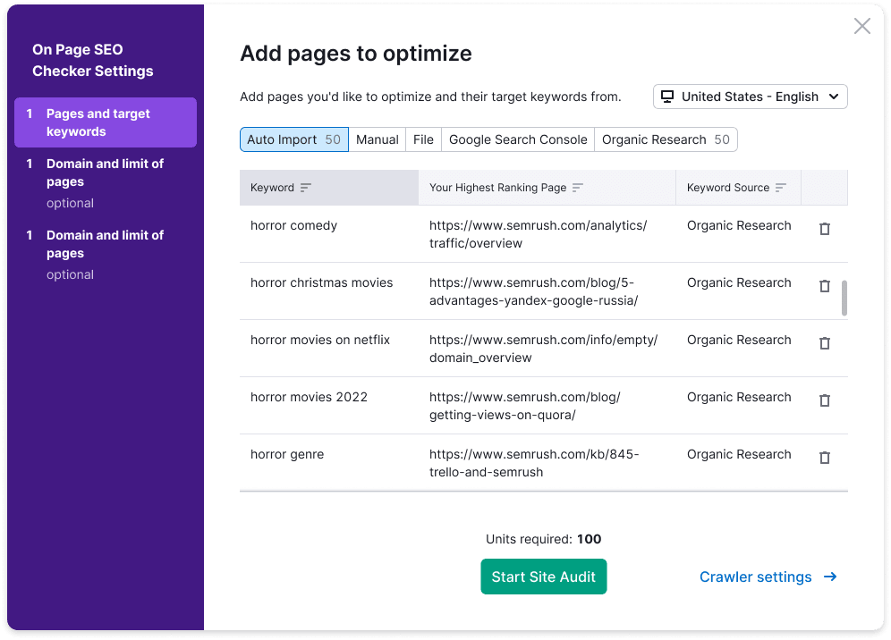
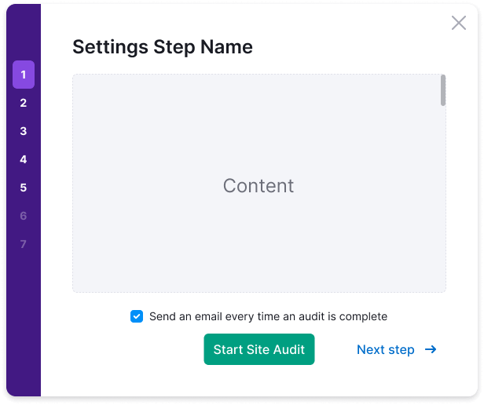
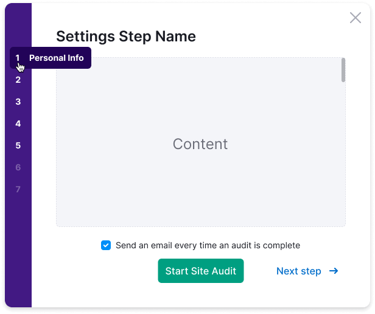
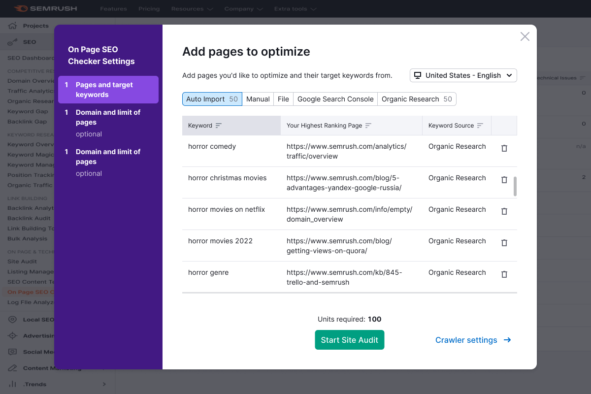
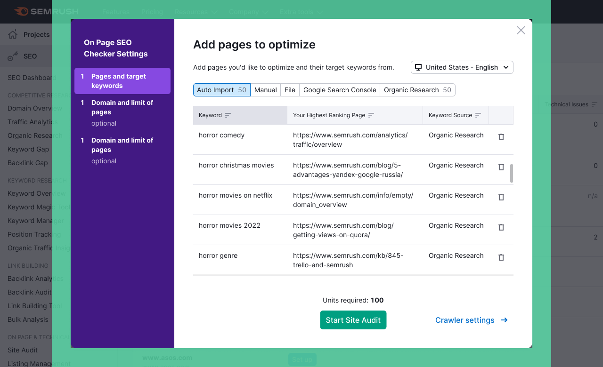
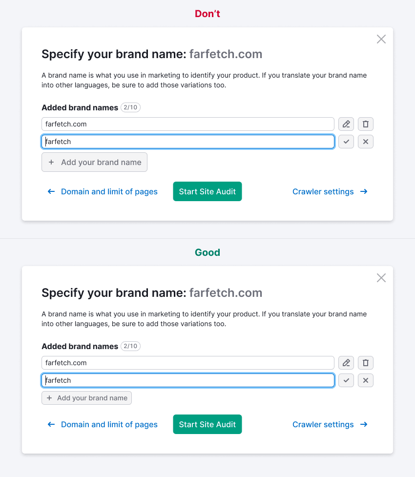

## Description

**Wizard** is a component that guides users through a series of predefined steps to complete a larger task. It simplifies complex tasks by breaking them down into manageable steps, reducing the perceived complexity.

### When to use wizard

- Use a wizard when dealing with large tasks that cannot be simplified. Breaking them down into steps helps users focus on each part of the task.
- If a task requires a specific sequence of steps to be followed, a wizard ensures users don't miss important parts and make fewer mistakes.
- Wizards are suitable when a task involves three-five steps. For smaller tasks with just two steps or very large tasks with more than ten steps, consider alternative approaches and components.

### When don’t use wizard

- Avoid using wizards for educational purposes, as they focus on task completion rather than providing additional information for learning. Instead, use components like [FeaturePopover](/components/feature-popover/feature-popover), `Info` icons, [hint links](/style/typography/typography#hints_hint_links), or videos for education.
- Advanced users may find predefined steps in a wizard restrictive. Consider using wizards for audiences that would benefit from step-by-step guidance.

## Component composition


Component consists of the following:

- `Wizard.Sidebar`
- `Wizard.Stepper`
- `Wizard.Content`
- `Wizard.Step`

## Sidebar styles

Table: Wizard sidebar styles

|           | Appearance example |
| --------- | ------------------ |
| Sidebar styles |  |
| Step styles    |  |
| Stepper styles |  If a stepper has optional text or a sub-step, they have the following styles:  |

## Stepper states

Table: Stepper states

| State    | Appearance example     | Styles      |
| -------- | ---------------------- | ----------- |
| Normal   |                                                         | `background-color: var(--control-primary-advertising)`, `border-radius: var(--rounded-medium)`                                                                     |
| Hover    |                                                          | `background-color: var(--control-primary-advertising-hover)`, `cursor: pointer`                                                                                    |
| Active   |                                                         | `background-color: var(--control-primary-advertising-active)`                                                                                                       |
| Disabled |   | Use `--disabled-opacity` token. When hovering on a button in this state, display a tooltip with a description of why the step is disabled. |
| checked  |                                                        | The number changes to a `Check` icon in size M.   |

## Content area styles

Table: Wizard content area styles

|          | Appearance example |
| -------- | ------------------ |
| Content area paddings |  |
| Header styles |  |
| Icon for closing window | The `Close` icon uses L size, and `--icon-secondary-neutral` token for color. On hover, the color of the icon changes to the next one in the palette – `--icon-secondary-neutral-hover-active`.  |
| Footer styles | For basic controls use L size.  |

## Keyboard control

- When opening a Wizard, the focus should move to it.
- Users can move between interactive elements within the window using the `Tab` key.
- The window can be closed with the `Esc` key.

When the fullscreen modal closes, the focus should return to the page. Refer to [Accessibility](/core-principles/a11y/a11y) guidelines.

## Wizard in Modal

For the Wizard displayed in a Modal, ensure the following styles:

```CSS
max-width: 980px;
max-height: 700px;
```




### Collapsing panel with steps on screen less than 1060px

Collapse the panel to 44px, leaving only the step numbers. On hover per step, show the name of the step.





### Placement

The scroll behavior inside and outside the window, the general rules for content, etc. are the same as for the [Modal component](/components/modal/modal).

Center the Wizard relative to the user's viewport. And leave margins of 40px outside the window.





## Usage in UX/UI

::: tip
For consistent user experience within products of the same platform, use a Wizard for setting up products.

In exceptional cases, steps can be placed in the content area of the page.
:::

Here are some scenarios where a universal solution is recommended:

### Form validation

After submitting a form, highlight all invalid inputs and focus on the first invalid input.

For more information about validation, refer to the [Validation](/patterns/validation-form/validation-form).


### Form loading error

If an error occurs on the backend while submitting a form, display the error message above the form.


### Sizes of controls in the form

In the form, use the same sizes for inputs and controls.



### Saving the entered value

If data entered into the form by the user was not sent and the window is closed, save the entered data so that the user doesn't lose it.

