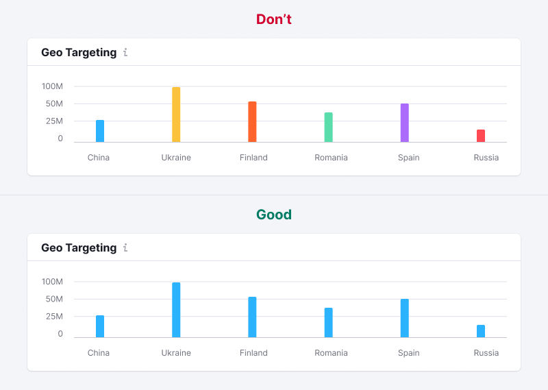
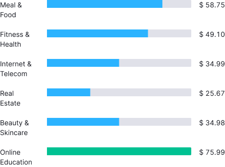
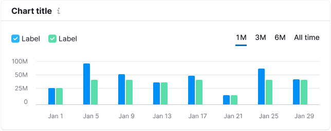
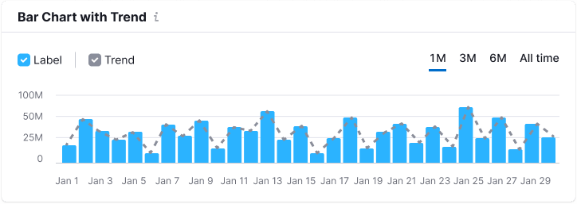
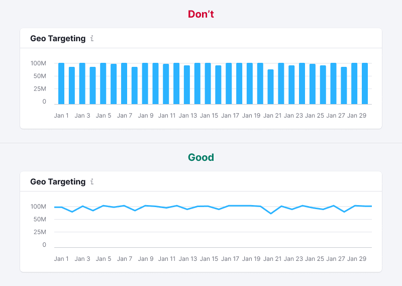
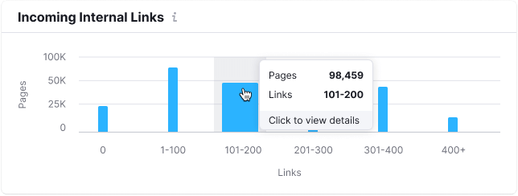
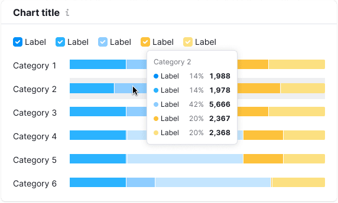
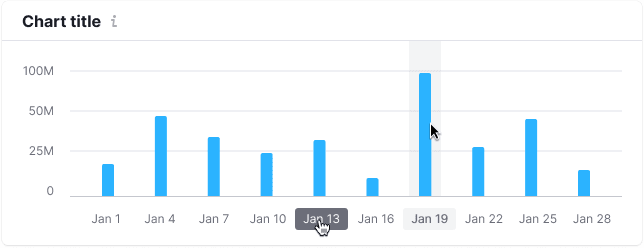
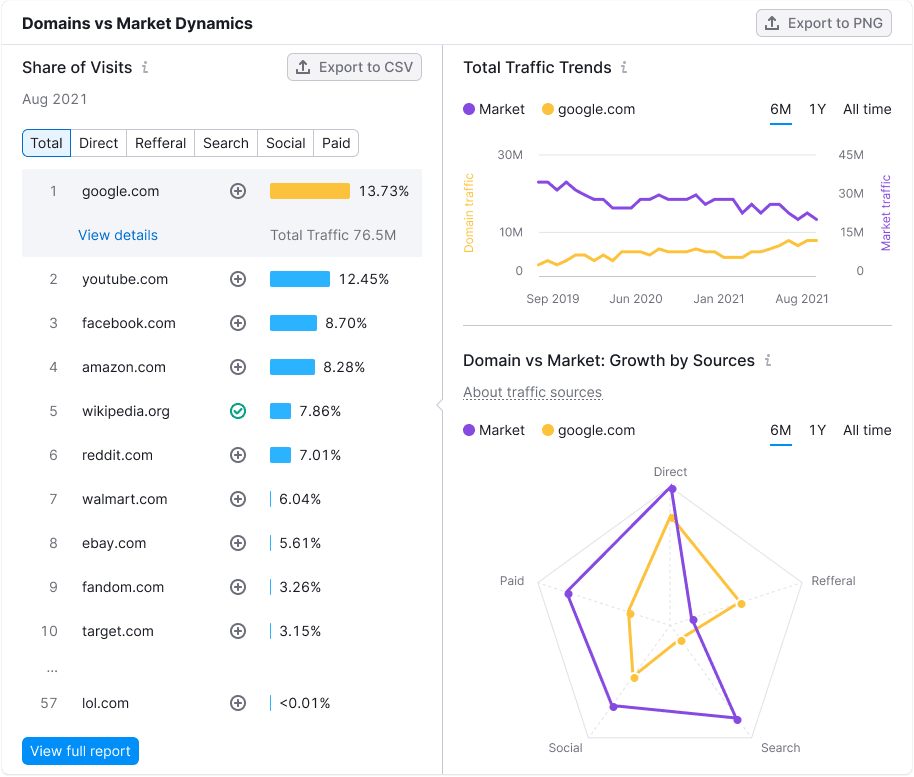

> Basic data visualization rules are described in the [Chart principles](/data-display/d3-chart).

## Description

**Bar chart** visualizes distribution of values by category for value comparison. A bar chart can be [vertical (like columns)](../bar-chart/bar-chart-vertical/) or [horizontal](/data-display/bar-horizontal/).

> **Difference from histogram chart**
>
> Bar chart displays distribution of data sets by quality categories.
>
> Histogram charts are used to display distribution of data sets: how often values fall into quantitative ranges.

Important points to keep in mind when presenting data as a bar chart:

- Always start the Y-axis from zero.
- The axes should be clear to the user from the chart name. However, in cases where the chart name isn’t enough, you can denote the axes.
- Don't use too many colors to represent categories. One color or shades of one color is enough. However, you can always highlight a category if necessary.

## Appearance

If you have two categories of values, you can place them next to each other – this makes it easier to track the trend of each of them. If there are more than two categories of values, represent the data as a different chart type (for example, a stacked bar chart).

> It is recommended to make a minimum 20% margin between a group of columns. This is necessary so that the data doesn't turn into mess.

### Chart colors

Use [special chart palette](/data-display/color-palette/) and follow the rules prescribed for it.

> If the data refers to the same category, the values shall not have different colors.

On the other hand, color can focus attention on a specific portion of data. For example, in some cases the size of the column may not be enough for visual hierarchy.

### Min-height and outliers (big values)

In some cases some of the values in the data can be very different from the majority of values. If you show this picture as it is, then large values will have all the attention, while the rest of the data will look like null.

> **The bar has a min-height of 2px.** It is necessary so that the column doesn't "disappear" if there are extremely large values next to it.

**Recommended solution for this case: make the scale not linear, but logarithmic.** In this case, the data will align with each other and remain comparable, and our outliers will still be the largest (although not so large).

> Read the **[article about other solutions](https://tomhopper.me/2010/08/30/graphing-highly-skewed-data/).**

If there are very large values, you may choose a different chart type which is better suited to solve your problem. Perhaps your visualization needs to focus on these large values?

## Legend

If there is only one category of values in the bar chart, you don't need legend. It is enough to clearly name the chart. Add labels to the axes only in specific cases, when chart title isn’t enough.

| Vertical bar chart example      | Horizontal bar chart example    |
| ------------------------------- | ------------------------------- |
|           |  |

> **Legend is required when there are two or more categories in the data set.**

| Vertical bar chart example   | Horizontal bar chart example      |
| ---------------------------- | --------------------------------- |
|   |         |

## Trend

A bar chart may have a trend line. Most often, trend line overloads charts. However, in some cases, it can be useful for reading the overall trend.

When you hover over any part of the column, the tooltip shall display all values of the bar item and the total value for the trend.

## Interaction

When you hover over a column, we highlight it with `--chart-grid-bar-chart-hover`. The hover takes up half of the margin column on the right and left sides.

If the column is clickable, the cursor changes to `pointer`.

If the chart has a trend line, then while hovering a line and a point shall be displayed on the trend line.

|                                   | Appearance example                        |
| --------------------------------- | ----------------------------------------- |
| Chart with one category           |                   |
| Chart with two or more categories |  |

> To see detailed information about tooltip for charts see [Chart principles](/data-display/d3-chart/#tooltip).

## Usage in UX/UI

### Start the axes from zero

By comparing columns, we are actually comparing the length. If we don’t start the axis from zero, there will be a visual illusion. Check out the charts below. In the wrong case, the axis doesn't start from zero, and it seems that the value on the right is almost half as large as the value on the left. However, this isn’t true.

If the values are very large and close to each other, you may not see the difference in the columns. In this case, we recommend using a line chart.

For such cases, you can add the possibility to switch the data display from bar chart to line chart in the settings.

### Sorting of columns

Keep in mind a reasonable order of values on the axes. For example, from the largest value to the smallest one, and if they represent months - from January to December, etc.

### Chart as an entry point

Sometimes the chart displays overall picture, and detailed data can be viewed when interacting with it. There are two typical cases.

#### The detailed information is contained in another report

In this case, clicking on the column opens the corresponding report. The column must have the `hover` state. You can add the `Click to view details` text to the chart tooltip for clarity.

When hovering over, the column/columns are highlighted with `--chart-grid-bar-chart-hover`.

| Vertical bar chart example  | Horizontal bar chart example |
| --------------------------- | ---------------------------- |
|  |   |

#### The detailed information is contained in the table below

In this case, clicking on the date/column opens the detailed and switches the period in the table to the corresponding date.

When you hover over a clickable date, it changes background `--chart-grid-period-bg`. In active state clickable date changes text color to `--text-invert` and background color to `--chart-x-axis-accent-period-active`.

| Vertical bar chart example     | Horizontal bar chart example       |
| ------------------------------ | ---------------------------------- |
|   |  |

@page bar-chart-vertical
@page bar-chart-a11y
@page bar-chart-api
@page bar-chart-d3-code
@page d3-chart-changelog
