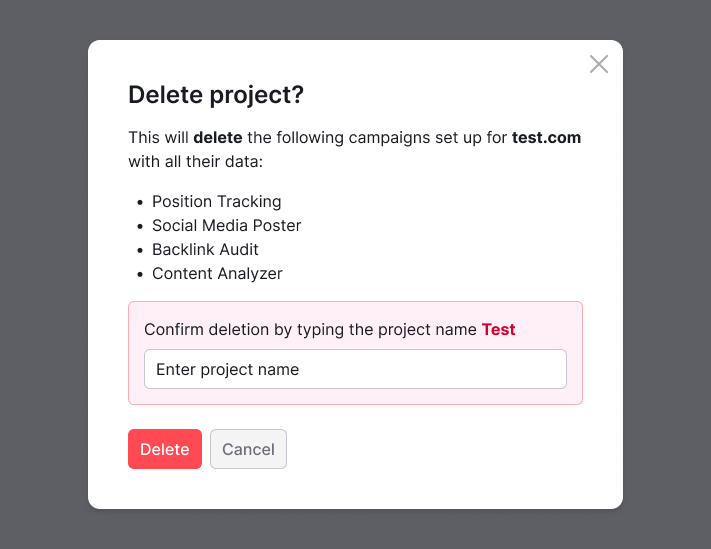

## Description

**Confirmation modal window** asks the user if they're sure that they want to proceed with the command that they've just issued to the system. It informs the user about potential problems or data loss and gives them a chance to reconsider the decision.

The dialog must have a clear descriptive message that explains what is happening. The user should be able to understand the message and have controls to act.

The dialog is built using the [Modal](/components/modal/) component.

## When to use

When the user is about to take an irreversible action, like permanently deleting an item, or when they're about to lose unsaved data, you need to ask them in advance if they understand what’s going to happen.

When the user is about to take an action that leads to serious consequences, for example changing network configuration, ensure the following:

- The dialog must explain what exactly will change.
- The user has to confirm the action by entering the requested value.

Try to avoid situations when the content in a modal dialog requires a scrollbar.

## Other recommendations

For more recommendations, refer to the [article from Nielsen Norman Group](https://www.nngroup.com/articles/confirmation-dialog/).

