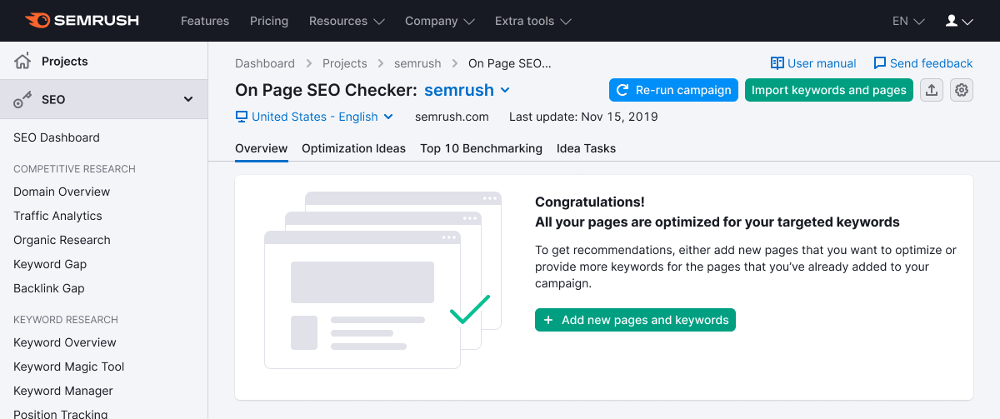
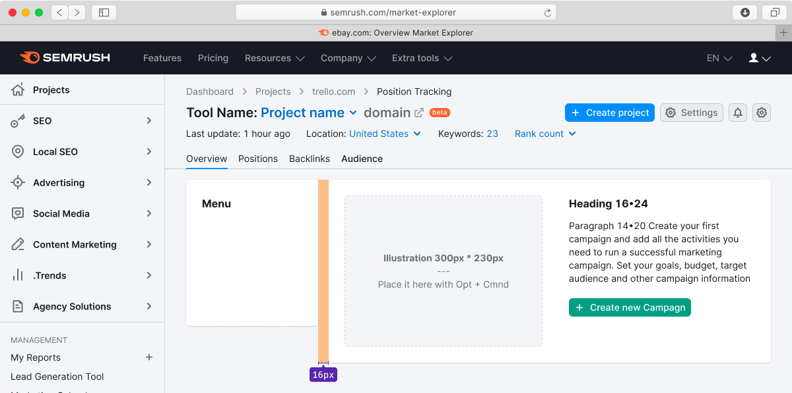

## Description

**Empty page** pattern represents the "blank" state of the product. It can serve as an advertising state to promote other products or services.

Typically, users encounter this state when certain actions are necessary to initiate product functionality and gather data.

**For instance, this state indicates:**

- Inability to display data due to the user's lack of access to the required product, service, or account.
- Absence of displayed data because the user has not yet created or configured anything within the product.
- A placeholder for an upcoming feature, such as "An exciting report will be available here soon," which functions as a preview for future features.

## Default styles

1. The illustration consistently resides to the left of the message, sized at 300px by 230px.
2. For the title, use text with a font size of 20px (`--fs-400`, `--lh-400` tokens).
3. Apply a font size of 14px (`--fs-200`, `--lh-200` tokens) for the description. Employ this font size judiciously, ensuring readability and contrast against the background.
4. The call-to-action (CTA) employs a button with the attribute use:"primary" and a medium (M) size.
5. The entire message aligns with the left side of the page and doesn't span the full width.
6. **Avoid content widths exceeding 660px, as it becomes difficult to read.**

As an option, consider adding a tertiary button that opens a dropdown with supplementary information.

### Margins and sizes

## Illustration

You can create illustrations for specific scenarios. These illustrations should fulfill an advertising role while reflecting the core essence of the product that is currently concealed from the user.

## Usage examples

### "Empty" state and sidebar

### "Empty" state in the table

For further details, refer to the [Table states](/table-group/table-states/#empty_table/).

