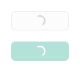
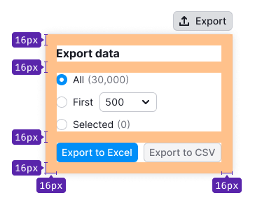
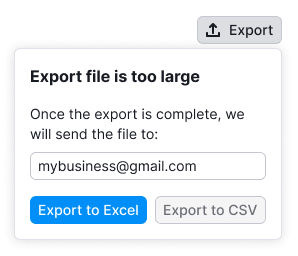
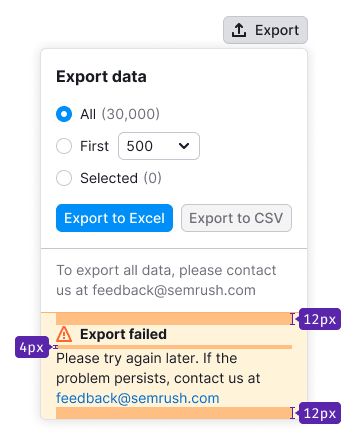
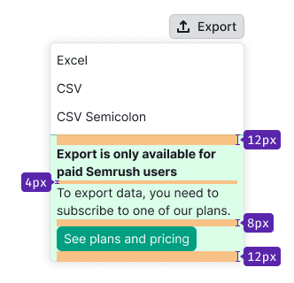
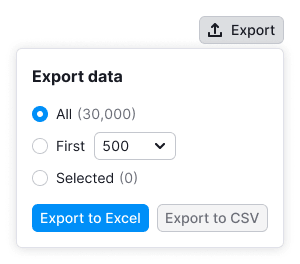

## Description

**Export pattern** describes elements and the process of data export to different formats.

To export data, use a button that the user can click to set up export and/or download data in a specific format immediately.

## Trigger

### Default

- Use this version wherever there is enough space and an ability to adjust export settings.
- If exporting is the target action on the page, use button with `use: "primary"`.
- Export button opens a dropdown menu with the form.

### Compact

- Use compact version if there's not enough space for the default version. Don’t forget to add tooltip with its label so the user will know what this button does.
- Export button opens a dropdown menu with the form.

### Expanded version

- Use this version if export is possible to the only one format and there are no additional settings.
- Export button opens a dropdown menu with the form.

::: tip
If there isn’thing to download, the file is anyway downloaded with the table headers. The file shouldn't be empty, because it is important to show the user that the export is working.

If the process is time consuming, the button gets loading state. The recommended time for showing spinner is `300ms`.
:::

## Dropdown

- The dropdown appears by clicking the export trigger. The trigger gets active state.
- The dropdown content may consist of the variety of components, depending on the product/report. And there should be at least two download buttons in the dropdown.
- The width and height of the dropdown depend on the content.

## Compact dropdown

If you can export at least in two formats, and no additional settings are needed, the button opens the list of data formats.

- When you click on the item, the dropdown closes and the file starts downloading in the browser.
- If the process is time consuming, the button gets loading state.

## Export with settings

- Add "Export data" title to such a dropdown.
- If the data can be exported to one or two formats, use full names in the buttons. _For example, `Export to CSV`._
- If the data can be exported to three formats, it is better to shorten the button names to the format name. _For example, you can use `CSV` instead of `Export to CSV`._
- If there is no data for all export parameters and settings, don't change button's state to the disabled.

::: tip
Additionally, you can add other necessary controls in the dropdown.
:::

### Postponed export

- Use this pattern if the file is too large and can't be exported straight away.
- Automatically fill the input with an email address from the user profile.
- Buttons should show possible formats for data exporting.

## Additional information

### Additional information on downloading all data and export in general

- Place it under the buttons.
- Use it as a explaining conditions for downloading all data. It concerns either limitation, large exporting, etc.
- Use [divider](/components/divider/) to separate this information from the form above.

Use this text as a message for such cases: "To export all data, please contact us at {email}". Or lead to the page with the custom report form, in such case this message: "To export all data, please order a custom report".

### Additional information concerning the selected export settings

- Place it under the buttons.
- If there is an additional information in the dropdown that is related to data export (as a result of selected settings, for example), then use [divider](/components/divider/) to separate it from the form above.

## Edge cases

### Error

For error messages use the following text: "Please try again later. If the problem persists, contact us at {email}".

- If the export operation fails, show [warning notice](/components/notice) at the bottom of the dropdown.
- If you know the problem, then write about it immediately in the heading.
- If you can't identify the problem, then write the standard text and email of the command.

In the compact version of dropdown, use [NoticeBubble](/components/notice-bubble) when this error occurs.

### Limit

For limit messages use [notice](/components/notice) at the bottom of the dropdown.

User can click all settings. It's allow the user explore the export opportunities that could be lost without upgrading. But the export buttons are have disabled state.

### Loading

- It may appear at the first opening of the dropdown and after clicking the export button.
- When loading, wrap all the form in the [SpinContainer](/components/spin-container/).
- Use Spin with XL size in all dropdowns.
- Dropdown closes after the loading state and file starts downloading in the browser.

## Work with the group of settings

- The "All" value is selected in the radio group by default, if nothing is chosen in the table.
- If the value is chosen in the table, the corresponding "Selected' value is selected when opening.
- Select opens and also automatically activates the radio button.

