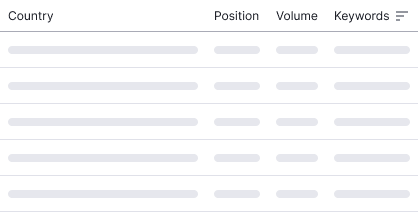
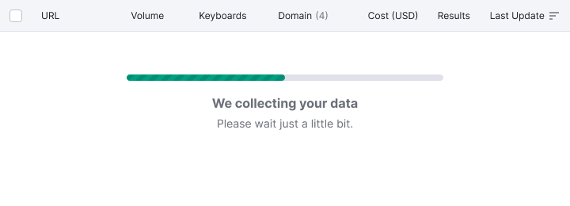

## Description

These components are employed to manage user expectations:

- [Spin](/components/spin/)
- [Skeleton](/components/skeleton/)
- [ProgressBar](/components/progress-bar/)

**Use them for different cases.** For detailed insights into each component, refer to their guides.

::: tip
Ensure that the container housing the loading message has margins. This prevents the container from becoming tightly attached to other elements on the page during cases like viewport size adjustments. The margin values are usually multiples of 4 (for example, for the spinner, we recommend using `margin: 40px`).
:::

## Response from the system

### Lazy loading

When you possess insight into the loading time of a page, apply the "Lazy Loading" principle to load the page.

For instance, if you know that a landing page loads quickly, you can progressively load elements without displaying either the spinner or the skeleton. Essential functionality, such as input fields and submit buttons, appear first, followed by illustrations and marketing content.

### Page loading

In all other circumstances, implement [Skeleton](/components/skeleton) to display while the page loads.

A delay of `600ms` should be incorporated before the skeleton becomes visible across all products. This delay mitigates flickering during transitions between products.

### Spin as user interface feedback

[Spin](/components/spin) should solely be employed when users interact with clickable interface elements on the page.

## Usage rules

### Skeleton

**Use it for:**

- Initial data loading.
- Displaying the structure of loading pages and data.
- Uploading new data.

### Spin

**Use it while:**

- Filtering substantial data within widgets/tables/pages.
- Sorting significant data within widgets/tables/pages.
- Conducting data searches.

::: tip
If the download process is rapid, this state can be omitted.
:::

### ProgressBar

Use it for scenarios where data collection extends beyond 5 seconds. This duration may differ across various widgets. For instance, within tables, if data collection takes longer than 1 minute.

