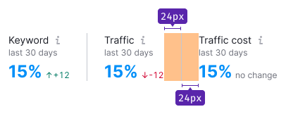
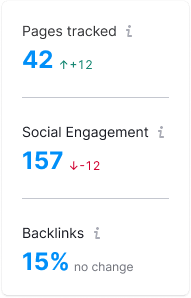
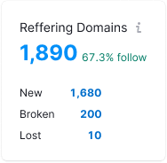
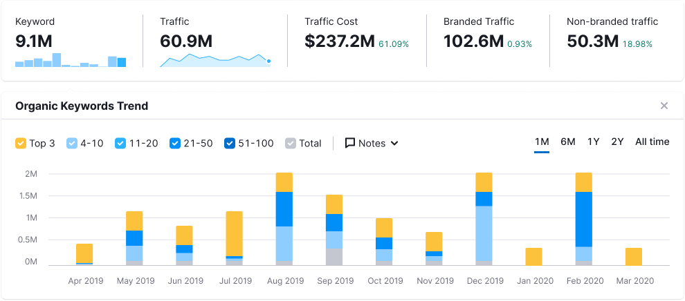

## Description

**Summary** is a pattern for displaying summary metrics and trends in the report or product.

**Use it to:**

- show user the main metrics of the report;
- display the main metric or metrics for data in a widget, table or somewhere else.

### Basic principles of using Summary

- It should be clear from the title and/or additional information nearby what the metric means. And it's useful when you can add information about how the metric is calculated.
- Display no more than 5-6 metrics on a report or in a widget. Thus, you will both reduce the cognitive load for the user.

## Pattern composition

Pattern consists of the following:

- Metric's title
- Additional information about date, period, location or database of the data
- Metric
- Additional information related to the metric (difference in values for a certain period, trend, etc. optional information)

## Margins and paddings

The common version of the summary metric:

If the metric consists of several others, so use these margins:

## Styles

|                                     | Styles                                                                                                                                                                                                                                                                |
| ----------------------------------- | --------------------------------------------------------------------------------------------------------------------------------------------------------------------------------------------------------------------------------------------------------------------- |
| **Title**                           | Text 14px (`--fs-200`, `--lh-200`) with `--text-primary` color. `Info` icon with M size. Or you can use M size icon if you need to display some brand metrics (eg., for social media)..                                                                               |
| **Date/period/location/database**   | Text 12px (`--fs-100`, `--lh-100`) with `--text-secondary` color.                                                                                                                                                                                                     |
| **Metric**                          | Text 24px (`--fs-500`, `--lh-500`) with `--text-primary` color or link color or some other color you use to show certain metrics in your product. Or you can make the text smaller (20px) or bigger (32px) if needed. See the [Typography scale](/style/typography/). |
| **Metric's additional information** | Text 12px (`--fs-100`, `--lh-100`) with `--text-secondary` color.                                                                                                                                                                                                     |
| **Other information**               | Text 12px (`--fs-100`, `--lh-100`) with `--text-secondary` color.                                                                                                                                                                                                     |

## Dividers

- Separate metrics with 24px margins and [Divider](/components/divider/).
- The last metric (last-child element) has no divider.

### Dividers between one-group metrics

Sometimes you need to group the metrics. In this case, don't separate metrics related to the one group with the divider.

## Horizontal & vertical layout

- The main metrics of the report/widget can be placed both horizontally and vertically, if required by the report layout.
- The vertical layout is more compact and saves space.

| Condition                                            | Layout type                                   | Appearance example                          |
| ---------------------------------------------------- | --------------------------------------------- | ------------------------------------------- |
| If there are more than 3 metrics in the interface -> | use horizontal layout                         |  |
| If there are 3 or less metrics in the frontend ->    | vertical layout                               |      |
| If there is one metric in the interface, than ->     | show the values of which this metric consists |  |

## Alignment

Metrics can be placed not only in separate widgets, but also inside the table cells and other components. Thus, the alignment of the metric and its additional information can be both left and right.

## Title

- If there are a lot of metrics and they don’t fit into the page width, collapse their title into `ellipsis`.
- Show the full title of the metric while hovering the title in the tooltip. You can also duplicate the title in the `Info` icon tooltip.

## Difference value

- Don't show the metric's title in the tooltip, because we already have it in the summary.
- While hovering diff value, show the tooltip with the previous and current value next to the metric. Don’t abbreviate the values in the tooltip.
- You can show both absolute and relative values inside the tooltip if needed.

 

## Summary with minitrends

Minitrends is a shortcut version of charts for displaying a trend, comparing a metric on different days, etc.

| Case                                                                                                                            | Appearance example                  |
| ------------------------------------------------------------------------------------------------------------------------------- | ----------------------------------- |
| If the metrics don’t fit into the maximum page width, arrange the data in a column – **move the minitrends under the metric.** |  |
| If your metrics use the same type of minitrends (for example, linear), make them the same width.                                |  |

### Tooltip

Show tooltips with values while hovering over the minitrend if necessary.

### Clickable minitrend

You can "hide" more detailed information (a whole widget with a full chart, for example) in the minitrend and make it clickable if:

- there is no need to show all charts at the same time;
- user flow doesn't provide for frequent analysis of charts.

#### Important tips

- The default period of the minitrend and the detailed chart must coincide.
- Changing the period on the chart visually doesn't affect the minitrend in the metric.

#### Mechanics

- By default, any of the clickable minitrend charts is shown as user opens the report.
- The detailed chart unfolds like an [Accordion](/components/accordion/), shifting the page content.
- When the [Accordion](/components/accordion/) is expanded, clicking on another minitrend replaces the content in it with the selected value.

| State   | Appearance example                            |
| ------- | --------------------------------------------- |
| Default |  |
| Hover   |  |
| Active  |  |

## Edge cases

| State                                                                                                                                                                               | Appearance example                         |
| ----------------------------------------------------------------------------------------------------------------------------------------------------------------------------------- | ------------------------------------------ |
| Show [Skeleton](/components/skeleton) while the first page load.                                                                                                                    |    |
| Show [Spin](/components/spin) after reloading the data, applying filters on the page, etc.                                                                                          |                    |
| Show `n/a` message if data is missing.                                                                                                                                              |  |
| If you cannot show metric because of the error, show `Warning` icon with M size and the reload link. While hovering over the icon show tooltip with `Something went wrong` message. |                 |
| Show `Something went wrong` message for metrics with errors. _The entire widget or individual metrics are covered by a white overlay with 80% transparency._                        |                  |

## Adaptivity

Summary widget can have maximum and minimum width at different resolutions.

- The maximum width of the Summary always depends on the content it contains.
- **Don’t stretch the metrics widget to the full width of the page.**

