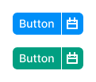

::: warning
:rotating_light: `NeighborLocation` component is deprecated and will be removed in the next releases.

:::
> Use property `neighborLocation` specification on components.
>
> We did this because of the unreliability of the API and the unpredictability of neighbor detection, especially in
> React 18's parallel render.

## Description

**NeighborLocation** is a component for grouping components. It indicates where the component is in relation to its
neighbors.

For example, you can group together:

- [Button](/components/button/)
- [Input](/components/input/)
- [Select](/components/select)

You may also need a `flex-box` to align the components. For more information, see
the [Flex-box and indent system](/layout/box-system/).

## Grouped buttons

Buttons can be grouped.

If you group primary buttons, the right one will have a 1px white border.

If you group secondary buttons, the left one will hide it's right border.

> Don’t group tertiary buttons this way.

@example neighbor-location

## Grouped input and button

@example neighbor-location-input

## Grouped input and select

@example neighbor-location-input-select

## Grouped input, select, and button

You can group input, select, and button.

@example neighbor-location-combo

## Adding a wrapper

By default, `<NeighborLocation/>` doesn't create an HTML wrapper, but you can pass the component tag you want.

> For the correct type mapping in the TC, you must also pass the interface.
> `<NeighborLocation<IFlexProps> tag={Flex} w={200}/>`

@example neighbor-location-with-tag

## Using a custom component

You can apply <NeighborLocation/> to your components. You will need to use the component `<NeighborLocation.Detect/>`
and
then the `neighborLocation` prop will come to your component.

> You can use the render function or the element will be cloned.

@example neighbor-location-with-custom

@page neighbor-location-api
@page neighbor-location-changelog
